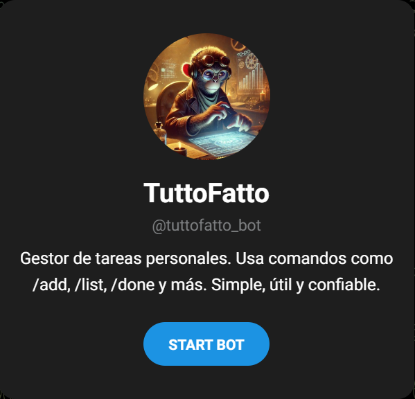

# Andrés Guerrero
Full-Stack Developer | Soluciones web, Frontend, backend, bots y automatización. Modularidad y tecnología actual.
---
#  ¡Hola! Soy Andrés

Full-Stack Developer enfocado en el desarrollo de soluciones modulares para aplicaciones web, backend y bots. Con experiencia en trabajo colaborativo, liderazgo técnico y gestión de proyectos utilizando metodologías ágiles y tableros Kanban en GitHub. Estoy completamente orientado a la calidad, la escalabilidad y las buenas prácticas en cada etapa del ciclo de desarrollo.
Mi forma de entender un proceso de desarrollo está basada en la metodología 4D (Discover, Draw, Do, Deploy); considero que un proyecto bien organizado desde el inicio facilita la creación de código de calidad.
Además, he aprendido a utilizar MQL5 porque disfruto de la economía y encuentro fascinante automatizar procesos de trading. La lógica que hay detrás de estos sistemas es única y, de hecho, ha fortalecido mi pensamiento lógico en otros lenguajes de programación.

---
## Tecnologías y Herramientas

### Lenguajes

### Frameworks, Librerías y UI

### Backend & Cloud

### Herramientas de Desarrollo

---

## Estás son mis estadísticas en GitHub

---

## Organización de proyectos

Trabajo con tableros Kanban para gestión ágil, ejemplo:  
[Mi tablero Kanban en GitHub Projects](https://github.com/users/ImixEs/projects/3/views/1)

---
## Mis proyectos destacados

### [Invexly Frontend](https://github.com/Andrz98/Invexly-frontend) & [Invexly Backend](https://github.com/Andrz98/Invexly-backend)
Aplicación full stack para gestión de usuarios y autenticación.  
#### **Frontend**:
Invexly frontend destaca por su enfoque en seguridad, control de sesión y una IU simple y clara. Desarrollé esta SPA en React y Vite priorizando una autenticación robusta, navegación protegida y gestión segura del perfil del usuario. Utilizo arquitectura modular, Atomic Design y validaciones automáticas con ESLint y Prettier para garantizar calidad y mantenibilidad. El flujo de autenticación evita exponer datos sensibles y asegura la permanencia del usuario, validando el estado en cada acceso.

#### **Backend:**
Invexly Backend es una API en Node.js, organizada bajo arquitectura MVC y centrada en la seguridad de la autenticación y la gestión de usuarios. Implementé validaciones estrictas de contraseña, encriptado seguro con bcrypt y manejo de sesiones mediante JWT y cookies httpOnly/secure. Las rutas y lógica de negocio están separadas para facilitar el mantenimiento y aplicar buenas prácticas. Uso helmet y CORS para proteger el servidor, además de pruebas automatizadas (Vitest, Supertest) que validan los flujos clave. El backend se integra con servicios externos (Brevo, Cloudinary, Render) y se comunica de forma controlada con el frontend en Netlify. Todo el flujo está diseñado para asegurar los datos y ofrecer una administración fiable del perfil del usuario.

#### **Features:**
- Arquitectura Full Stack: Aplicación dividida en frontend (React, Vite, Atomic Design) y backend (Node.js, Express, MVC), con comunicación vía API segura.

- Gestión de usuarios: Registro, inicio de sesión, edición de perfil y cierre de sesión, con autenticación robusta basada en JWT y cookies seguras.

- Control de sesión: Validación automática de tokens y gestión de sesiones tanto en frontend como backend para asegurar la permanencia del usuario.

- Seguridad avanzada: Validaciones estrictas, cifrado de contraseñas, protección con helmet y CORS, y uso de cookies httpOnly/secure.

- Carga y gestión de avatares: Integración con Cloudinary para almacenamiento y actualización de imágenes de perfil.

- Correo transaccional: Envío de emails de bienvenida y notificaciones usando Brevo.

- Diseño responsive: Interfaz clara y adaptable desarrollada con Tailwind CSS y DaisyUI.

- Calidad de código: Uso de ESLint y Prettier en todo el stack, junto con pruebas automatizadas (Vitest, Supertest) para validar los principales flujos.

- Despliegue profesional: Backend alojado en Render y frontend en Netlify, con control de orígenes y comunicación protegida.

---
### [TuttoFatto ToDo Bot](https://github.com/Andrz98/ToDoBot)

TuttoFatto ToDo Bot es un bot modular para Telegram, diseñado bajo arquitectura MVC y orientado a la gestión fiable de tareas y recordatorios. He implementado recordatorios automáticos en múltiples intervalos, control de zona horaria y pruebas unitarias para asegurar estabilidad. El sistema de autorización restringe el uso solo a usuarios registrados, y los middlewares aplican sanitización de entradas, rate limiting y validación de variables antes de ejecutar cualquier flujo. Utilizo node-cron para programar recordatorios, UptimeRobot para monitorizar la disponibilidad, y rutas protegidas para evitar accesos indebidos. Todas las comunicaciones con Telegram usan funciones seguras y reintentos automáticos, garantizando integridad incluso ante errores de red. Este bot está pensado para ofrecer una experiencia de gestión de tareas segura, controlada y siempre disponible en Telegram.

#### **Features:**
- Arquitectura modular y MVC: Organización clara de acciones, controladores, middlewares y modelos para facilitar el mantenimiento y la escalabilidad.

- Gestión avanzada de tareas: Creación, edición, listado, completado y eliminación de tareas desde Telegram.

- Recordatorios automáticos: Notificaciones programadas en intervalos múltiples (72h, 48h, 24h, 7h, 3h y 10 min antes del vencimiento) usando node-cron.

- Control de zona horaria: Selección de timezone para notificaciones precisas.

- Seguridad y control de acceso: Middleware de autorización (solo usuarios registrados), sanitización de entradas y rate limiting.

- Flujos guiados por menús: Interfaz interactiva para recibir datos y navegar entre comandos.

- Pruebas automáticas: Validación de componentes clave y flujos principales con Vitest.

- Monitorización y disponibilidad: UptimeRobot monitoriza el endpoint para asegurar que el bot esté siempre operativo y reduzca los tiempos de espera.

- Comunicación robusta: Funciones de envío y respuesta con reintentos automáticos ante errores de red, y endpoint seguro para el webhook.

